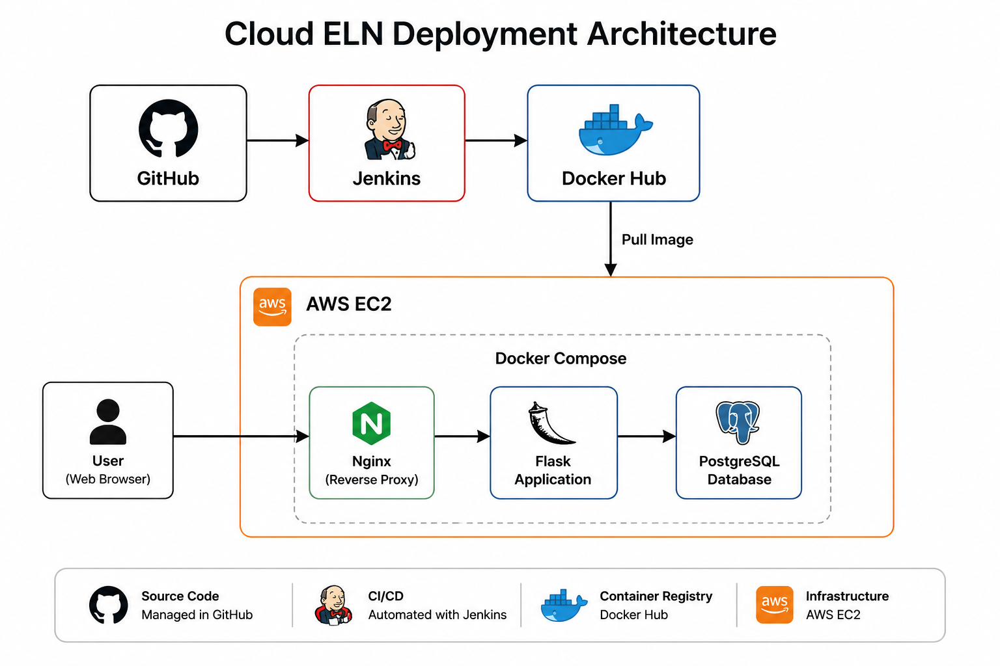
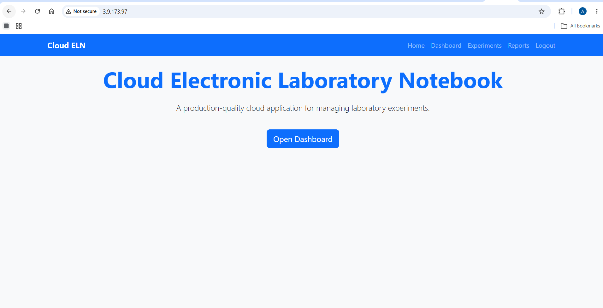
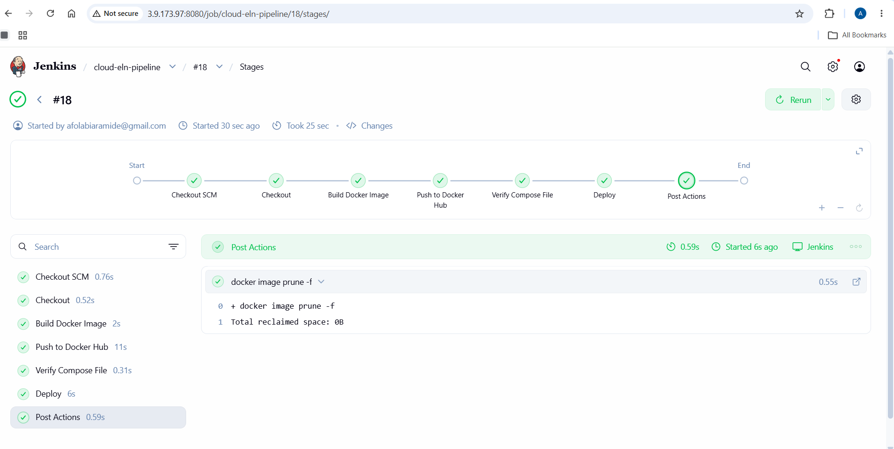
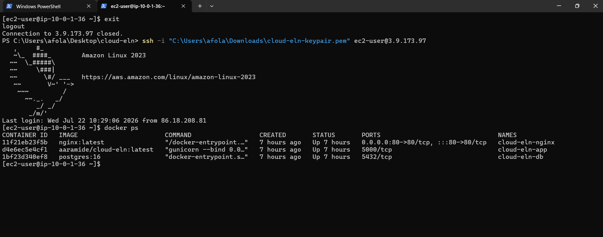
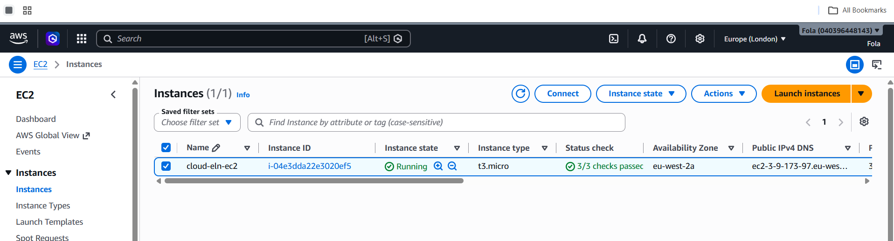
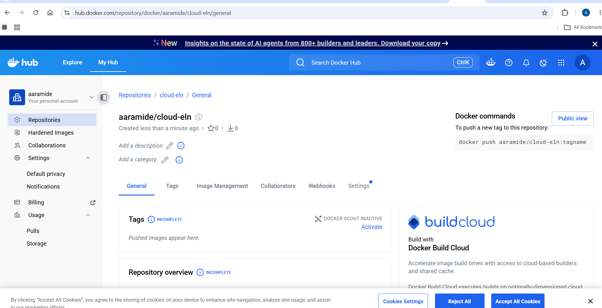
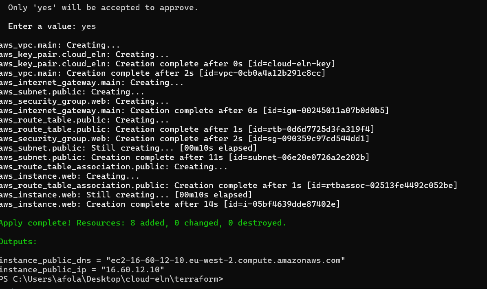

# Cloud ELN (Electronic Laboratory Notebook)

A cloud-hosted Electronic Laboratory Notebook (ELN) designed to demonstrate modern DevOps and cloud engineering practices.

This project showcases how a containerised Flask application can be deployed on AWS using Infrastructure as Code (Terraform) and automated through a Jenkins CI/CD pipeline.

---

## Project Overview

Cloud ELN is a web application that allows laboratory users to securely manage experimental records in a cloud environment.

The project was built to demonstrate practical experience with:

- Infrastructure as Code (Terraform)
- Containerisation (Docker and Docker Compose)
- Continuous Integration and Continuous Deployment (Jenkins)
- Cloud deployment on AWS EC2
- Reverse proxy configuration using Nginx
- PostgreSQL database deployment
- Git-based development workflow

---

# Architecture



---

# Technology Stack

| Category | Technologies |
|----------|--------------|
| Cloud | AWS EC2 |
| Infrastructure as Code | Terraform |
| Backend | Flask (Python) |
| Database | PostgreSQL |
| Containerisation | Docker, Docker Compose |
| Reverse Proxy | Nginx |
| CI/CD | Jenkins |
| Source Control | Git & GitHub |
| Container Registry | Docker Hub |

---

# Features

- Cloud-hosted Flask application
- PostgreSQL database integration
- Docker multi-container deployment
- Nginx reverse proxy
- Infrastructure provisioned using Terraform
- Automated CI/CD pipeline with Jenkins
- Docker Hub image publishing
- Secure environment variable configuration
- Git feature branch workflow
- Production-ready deployment architecture

---

# Project Structure

```text
cloud-eln/
│
├── app/
├── migrations/
├── nginx/
├── terraform/
├── instance/
├── screenshots/
├── docker-compose.yml
├── Dockerfile
├── Jenkinsfile
├── requirements.txt
├── run.py
└── README.md
```

---

# CI/CD Pipeline

The deployment pipeline automatically performs the following steps whenever code is pushed to the configured branch:

1. Checkout source code from GitHub
2. Build Docker image
3. Push image to Docker Hub
4. Connect to AWS EC2 via SSH
5. Pull latest Docker image
6. Restart containers using Docker Compose

Pipeline Flow:

```
GitHub
    │
    ▼
 Jenkins
    │
    ▼
Docker Build
    │
    ▼
Docker Hub
    │
    ▼
AWS EC2
    │
    ▼
Docker Compose
    │
    ▼
Cloud ELN
```

---

# Infrastructure

Terraform provisions the AWS infrastructure required to host the application, including:

- EC2 Instance
- Security Group
- Networking configuration
- User data bootstrapping
- Infrastructure variables
- Reusable Terraform configuration

---

# Deployment Architecture

```
                GitHub
                   │
                   ▼
              Jenkins CI/CD
                   │
         Docker Build & Push
                   │
                   ▼
              Docker Hub
                   │
                   ▼
               AWS EC2
                   │
      Docker Compose Deployment
                   │
      ┌────────────┴────────────┐
      │                         │
      ▼                         ▼
 Flask Application        PostgreSQL
          │
          ▼
        Nginx
          │
          ▼
       End Users
```

---

# Screenshots

## Application



---

## Jenkins Pipeline



---

## Docker Containers



---

## AWS EC2 Instance



---

## Docker Hub Repository



---

## Terraform Deployment



---

# Running Locally

Clone the repository

```bash
git clone https://github.com/YOUR_USERNAME/cloud-eln.git

cd cloud-eln
```

Build and start the containers

```bash
docker-compose up --build
```

Application

```
http://localhost
```

---

# Future Improvements

Planned enhancements include:

- Kubernetes deployment
- Amazon EKS
- GitOps with Argo CD
- Monitoring with Prometheus & Grafana
- HTTPS using Let's Encrypt
- AWS RDS integration
- Remote Terraform state
- Terraform modules
- Multi-environment deployments
- Automated testing

---

# Skills Demonstrated

- AWS Cloud
- Terraform
- Docker
- Docker Compose
- Jenkins
- CI/CD
- Flask
- PostgreSQL
- Nginx
- Git
- GitHub
- Linux
- Infrastructure as Code
- Cloud Deployment
- DevOps

---

# Author

**Afolabi Aramide**

GitHub: https://github.com/folaaramide

LinkedIn:
(https://www.linkedin.com/in/afolabi-aramide/)

---

# License

This project is provided for educational and portfolio purposes.
